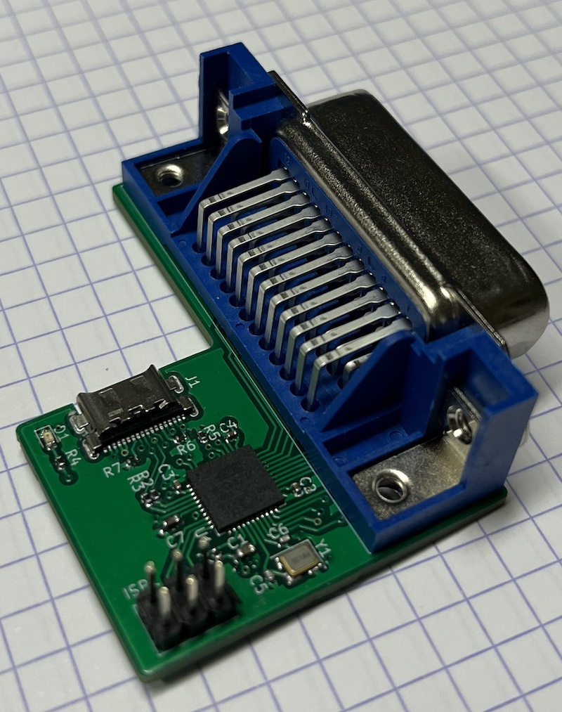
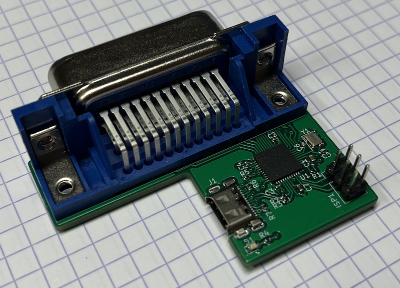

# About

This is a redesign of the VQFN PCB with an USB Type-C connector.  It
also uses 0402 passives most of the time, LED and >= 1uF caps are 0603.

All components are laid out on Top layer, this allows to mount with
stenciling and hot plate.

In Release directory, `UsbGpibTypeC_A.zip`, `UsbGpibTypeC_A_BOM.csv`
and `UsbGpibTypeC_A-pos-JLC.xls` can be used directly with JLCPCB SMT
service.

